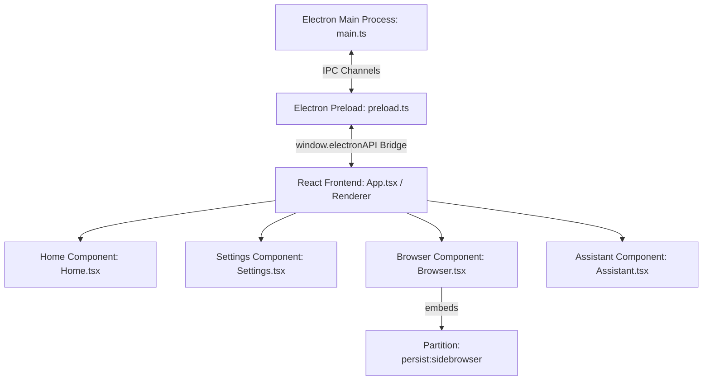

# SideBrowser Codebase Wiki (.llmwiki.md)

This document is the absolute source of truth for AI LLM coding assistants working on the SideBrowser project. It details the project architecture, component structures, IPC messaging rules, and critical stability workarounds. Read this document before proposing changes.

---

## 🏗️ Project Architecture Overview

SideBrowser is a sliding side-panel desktop browser built with **Electron, React (v19), TypeScript, and TailwindCSS (v4)**.



### Process Breakdown
1.  **Main Process (`electron/main.ts`):** Creates the main transparent window, sets window bounds, loads/stores user configuration via `electron-datastore`, and configures network interceptors (adblocker, headers, Google login, and agentic integrations).
2.  **Preload Script (`electron/preload.ts`):** Exposes IPC events securely to the React renderer via `contextBridge.exposeInMainWorld('electronAPI', ...)`.
3.  **Renderer Process (`src/`):** React 19 single-page application compiled via Vite. 
    - `src/App.tsx`: Central coordinator managing current views, sidebars, window snaps, tab lists, and layout switches.
    - `src/Assistant.tsx`: Integrated AI chatbot/assistant. Handles multimodal inputs (screen captures, copy-pasted images, open window screenshots, file uploads), LLM provider configuration, and speech triggers (TTS, voice dictation).
    - `src/Browser.tsx`: Component managing a list of Electron `<webview>` tags with address bar zone detections.
    - `src/Settings.tsx`: Options panel (including opacity, auto-hide, drag margin, and API credentials).
    - `src/contexts/SettingsContext.tsx`: Global configuration state synced to the disk using `electronAPI.getStoreValue` / `setStoreValue`.
4.  **Webview Preload Script (`electron/webview-preload.ts`):** Script injected directly into guest pages to handle scrollbar custom styling.

---

## 🔑 Crucial Webview Stability & Bot Detection Bypass Rules

Do not modify or alter the following session or network interceptors without absolute necessity, as modern web applications (ChatGPT, Gemini) are highly sensitive to Electron webview headers:

### 1. Gemini "Error 13" / Bot Detection Prevention
- **Dynamic User-Agent Sync:** Gemini relies on Chrome Client Hints matching the raw User-Agent headers. In `main.ts`, we extract the default Chrome engine User-Agent and strip out all references to `"SideBrowser"` or `"Electron"` (`cleanNativeUA`).
- **Disk-Backed Partition:** In `Browser.tsx`, all `<webview>` elements must run on the `"persist:sidebrowser"` session partition:
  ```html
  <webview partition="persist:sidebrowser" ... />
  ```
  Using a persistent disk-backed partition ensures IndexedDB and Service Workers load correctly, avoiding session initialization errors.

### 2. Adblocker (Ghostery) Network Interception Whitelisting
To prevent infinite recursion stack-overflows in ChatGPT/Next.js and secure streaming in Gemini:
- We wrap `ses.webRequest.onBeforeRequest` and `ses.webRequest.onHeadersReceived` in `main.ts`.
- Any request directed to AI domains (`chatgpt.com`, `chat.openai.com`, `google.com`, `googleapis.com`, `gstatic.com`, `googleusercontent.com`) or requests with resource type `serviceWorker` **must bypass the Ghostery blocker rules** by resolving immediately with `{ cancel: false }` or `{ responseHeaders: ... }`.

### 3. Google Accounts Login Bypass
Webviews normally block Google OAuth login. We bypass this restriction by intercepting headers directed at `https://accounts.google.com/*`:
- **Request Headers:** User-Agent is rewritten to `cleanLoginUA` (standard Chrome User-Agent).
- **Response Headers:** `Content-Security-Policy`, `X-Frame-Options`, and `Cross-Origin-Resource-Policy` headers are deleted from text/html responses to allow Google Account prompts to render in iframe/webviews.

### 4. OS-Level Secret & Credential Encryption (safeStorage)
To ensure user data privacy, API Keys (`aiApiKey`) and Password Manager credentials are encrypted at rest using Electron's native `safeStorage` API:
- **Base64 Storage:** Since standard JSON storage doesn't support binary buffers directly, encrypted data is encoded to base64 before storing.
- **Main-Process Sandboxing:** In Settings, when React loads configurations, `get-store-value` for `aiApiKey` intercepts the request and only returns a placeholder string `••••••••••••••••` if the key exists. React never gets access to the actual plaintext key.
- **Decryption on Demand:** When streaming queries (`ai:query-llm-stream`), fetching dynamic models (`ai:get-available-models`), or querying balance (`ai:get-provider-balance`), the Main process retrieves the encrypted key from disk, decrypts it in memory using DPAPI (Windows) or Keychain (macOS), and communicates securely with the API endpoints.

---

## 🔗 IPC Interface Definition

Below are the key APIs exposed via the preload script (`window.electronAPI`):

| Method Name | Direction | Payload | Description |
| :--- | :--- | :--- | :--- |
| `getStoreValue(key)` | Renderer ➔ Main | `string` | Retrieves a configuration value from the store. |
| `setStoreValue(key, val)`| Renderer ➔ Main | `string, any` | Stores a configuration value on the disk. |
| `hideWindow()` | Renderer ➔ Main | None | Slides out / hides the browser panel. |
| `resizeWindow(delta)` | Renderer ➔ Main | `{ deltaX, deltaY }`| Resizes the application window during drag. |
| `onWindowBlur(cb)` | Main ➔ Renderer | `callback` | Emitted when focus is lost, triggering autohide. |
| `onWindowFocus(cb)` | Main ➔ Renderer | `callback` | Emitted when focus is restored. |
| `aiQueryLLM(prompt, tId, img)`| Renderer ➔ Main | `string, string, string` | Non-streaming direct query to the active LLM provider. |
| `aiQueryLLMStream(prompt, tId, provider, model, endpoint, apiKey, imgs, style)` | Renderer ➔ Main | `string, string, string, string, string, string, string[], string` | Starts a streaming request to the target LLM provider with base64 images and parameters. |
| `onAiStreamChunk(cb)` | Main ➔ Renderer | `callback` | Event listener that returns chunks `{ threadId, chunk, usage }` (with usage statistics if available). |
| `onAiStreamDone(cb)` | Main ➔ Renderer | `callback` | Event listener fired when stream finishes. |
| `onAiStreamError(cb)` | Main ➔ Renderer | `callback` | Event listener fired when stream fails with `{ threadId, error }`. |
| `aiCaptureScreenRegion()` | Renderer ➔ Main | None | Triggers screenshot region tool, returns base64 PNG string. |
| `aiGetOpenWindows()` | Renderer ➔ Main | None | Returns metadata (names, icons, base64 thumbnails) of open system windows. |
| `aiAttachFile()` | Renderer ➔ Main | None | Triggers file picker dialog and returns content (image base64 or text file contents). |
| `aiTriggerDictation()` | Renderer ➔ Main | None | Starts system-level voice-to-text dictation. |
| `aiFileOperation(action, path, content)` | Renderer ➔ Main | `string, string, string` | File-system utility for LLM interaction (reads, writes, or checks files). |
| `aiExecuteAutomation(cmd)` | Renderer ➔ Main | `any` | Runs automation scripts or command-line shortcuts. |
| `aiGetAvailableModels(provider, endpoint)` | Renderer ➔ Main | `string, string` | Dynamically fetches available models from the selected provider. |
| `aiGetProviderBalance(provider, endpoint)` | Renderer ➔ Main | `string, string` | Queries remaining API credits or usage details for the active provider. |

---

## 🤖 AI Assistant & Multimodal Integration Details

To preserve token context and optimize responses, the `src/Assistant.tsx` uses custom parsers and features:
1. **Deep Reasoning Formatting:**
   - LLMs utilizing thinking steps (like DeepSeek-R1) generate outputs containing `<think> ... </think>` blocks.
   - The frontend parses these blocks dynamically, extracting the content into a toggleable UI dropdown called "Reasoning process" to keep the main conversation clean.
2. **Text-to-Speech (TTS):**
   - Implemented via HTML5 `SpeechSynthesisUtterance`.
   - Toggle behavior: clicking the TTS volume icon reads aloud. Clicking the icon again during speech calls `speechSynthesis.cancel()` to abort playback immediately.
3. **Multimodal Inputs:**
   - Clipboard events (`onPaste`) intercept file/image drops or copied screenshots (`Ctrl+C` pasting of windows' Snipping Tool captures) and attach them directly to the prompt.
   - Screen capture tools call native Electron APIs to hide SideBrowser temporarily, draw a transparent selection crop frame, and capture screen bounds.
4. **Token Tracking & Context Gauges:**
   - Track prompt and completion tokens dynamically from stream payload.
   - Display a context usage gauge dynamically calculated using model thresholds (e.g. 2M for Gemini 1.5 Pro, 128k for GPT-4o, 64k for DeepSeek, 8k for local models).
   - Render remaining balance indicators in the Chat assistant header.

---

## 🎨 Design Tokens & UI Guidelines
- **Color Variables:** Custom TailwindCSS configuration using CSS custom properties (`var(--theme-text)`, `var(--theme-sidebar)`, `var(--theme-active)`, etc.).
- **Transitions:** Animations must leverage Framer Motion or smooth Tailwind utility transitions (`transition-all duration-200`).
- **Transparency:** The CSS variable `--transparency` controls background opacity. Use `color-mix(in srgb, var(--theme-sidebar) calc(var(--transparency) * 100%), transparent)` to blend colors harmoniously with the desktop background.
