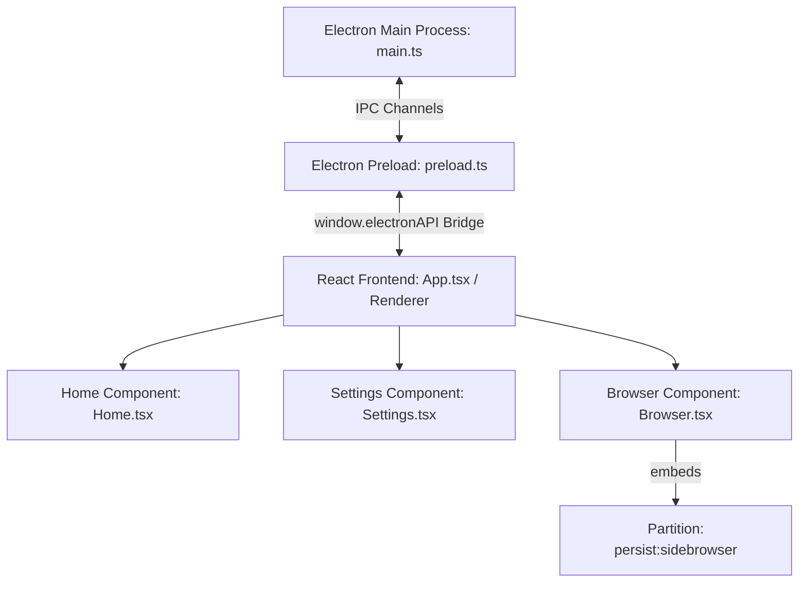

# SideBrowser Codebase Wiki (.llmwiki.md)

This document is the absolute source of truth for AI LLM coding assistants working on the SideBrowser project. It details the project architecture, component structures, IPC messaging rules, and critical stability workarounds. Read this document before proposing changes.

---

## 🏗️ Project Architecture Overview

SideBrowser is a sliding side-panel desktop browser built with **Electron, React (v19), TypeScript, and TailwindCSS (v4)**.



### Process Breakdown
1.  **Main Process (`electron/main.ts`):** Creates the main transparent window, sets window bounds, loads/stores user configuration via `electron-datastore`, and configures network interceptors (adblocker, headers, and agentic integrations).
2.  **Preload Script (`electron/preload.ts`):** Exposes IPC events securely to the React renderer via `contextBridge.exposeInMainWorld('electronAPI', ...)`.
3.  **Renderer Process (`src/`):** React 19 single-page application compiled via Vite. 
    - `src/App.tsx`: Central coordinator managing current views, sidebars, window snaps, tab lists, and layout switches.
    - `src/Browser.tsx`: Component managing a list of Electron `<webview>` tags with address bar zone detections.
    - `src/Settings.tsx`: Options panel.
    - `src/contexts/SettingsContext.tsx`: Global configuration state synced to the disk using `electronAPI.getStoreValue` / `setStoreValue`.
4.  **Webview Preload Script (`electron/webview-preload.ts`):** Script injected directly into guest pages to handle scrollbar custom styling.

---

## 🔑 Crucial Webview Stability & Bot Detection Bypass Rules

Do not modify or alter the following session or network interceptors without absolute necessity, as modern web applications (ChatGPT, Gemini) are highly sensitive to Electron webview headers:

### 1. Gemini "Error 13" / Bot Detection Prevention
- **Dynamic User-Agent Sync:** Gemini relies on Chrome Client Hints matching the raw User-Agent headers. In `main.ts`, we extract the default Chrome engine User-Agent and strip out all references to `"SideBrowser"` or `"Electron"` (`cleanNativeUA`).
- **Disk-Backed Partition:** In `Browser.tsx`, all `<webview>` elements must run on the `"persist:sidebrowser"` session partition:
  ```html
  <webview partition="persist:sidebrowser" ... />
  ```
  Using a persistent disk-backed partition ensures IndexedDB and Service Workers load correctly, avoiding session initialization errors.

### 2. Adblocker (Ghostery) Network Interception Whitelisting
To prevent infinite recursion stack-overflows in ChatGPT/Next.js and secure streaming in Gemini:
- We wrap `ses.webRequest.onBeforeRequest` and `ses.webRequest.onHeadersReceived` in `main.ts`.
- Any request directed to AI domains (`chatgpt.com`, `chat.openai.com`, `google.com`, `googleapis.com`, `gstatic.com`, `googleusercontent.com`) or requests with resource type `serviceWorker` **must bypass the Ghostery blocker rules** by resolving immediately with `{ cancel: false }` or `{ responseHeaders: ... }`.

### 3. Google Accounts Login Bypass
Webviews normally block Google OAuth login. We bypass this restriction by intercepting headers directed at `https://accounts.google.com/*`:
- **Request Headers:** User-Agent is rewritten to `cleanLoginUA` (standard Chrome User-Agent).
- **Response Headers:** `Content-Security-Policy`, `X-Frame-Options`, and `Cross-Origin-Resource-Policy` headers are deleted from text/html responses to allow Google Account prompts to render in iframe/webviews.

---

## 🔗 IPC Interface Definition

Below are the key APIs exposed via the preload script (`window.electronAPI`):

| Method Name | Direction | Payload | Description |
| :--- | :--- | :--- | :--- |
| `getStoreValue(key)` | Renderer ➔ Main | `string` | Retrieves a configuration value from the store. |
| `setStoreValue(key, val)`| Renderer ➔ Main | `string, any` | Stores a configuration value on the disk. |
| `hideWindow()` | Renderer ➔ Main | None | Slides out / hides the browser panel. |
| `resizeWindow(delta)` | Renderer ➔ Main | `{ deltaX, deltaY }`| Resizes the application window during drag. |
| `onWindowBlur(cb)` | Main ➔ Renderer | `callback` | Emitted when focus is lost, triggering autohide. |
| `onWindowFocus(cb)` | Main ➔ Renderer | `callback` | Emitted when focus is restored. |

---

## 🎨 Design Tokens & UI Guidelines
- **Color Variables:** Custom TailwindCSS configuration using CSS custom properties (`var(--theme-text)`, `var(--theme-sidebar)`, `var(--theme-active)`, etc.).
- **Transitions:** Animations must leverage Framer Motion or smooth Tailwind utility transitions (`transition-all duration-200`).
- **Transparency:** The CSS variable `--transparency` controls background opacity. Use `color-mix(in srgb, var(--theme-sidebar) calc(var(--transparency) * 100%), transparent)` to blend colors harmoniously with the desktop background.
