# SideBrowser Dependency & IPC Communication Graph

This file is automatically generated by running `npm run graphify`. It illustrates the internal module imports and inter-process IPC communication channels.

- **Orange Nodes:** Electron Main Process scripts
- **Blue Nodes:** React Renderer frontend components
- **Double Thick Lines (==):** IPC Event-driven messaging

```mermaid
flowchart TD
    classDef main fill:#f96,stroke:#333,stroke-width:2px,color:#000;
    classDef renderer fill:#6cf,stroke:#333,stroke-width:1px,color:#000;

    %% File Nodes
    src_App_tsx["src/App.tsx"]
    class src_App_tsx renderer;
    src_Assistant_tsx["src/Assistant.tsx"]
    class src_Assistant_tsx renderer;
    src_Browser_tsx["src/Browser.tsx"]
    class src_Browser_tsx renderer;
    src_contexts_SettingsContext_tsx["src/contexts/SettingsContext.tsx"]
    class src_contexts_SettingsContext_tsx renderer;
    src_Home_tsx["src/Home.tsx"]
    class src_Home_tsx renderer;
    src_main_tsx["src/main.tsx"]
    class src_main_tsx renderer;
    src_Settings_tsx["src/Settings.tsx"]
    class src_Settings_tsx renderer;
    src_types_d_ts["src/types.d.ts"]
    class src_types_d_ts renderer;
    src_utils_themes_ts["src/utils/themes.ts"]
    class src_utils_themes_ts renderer;
    electron_main_ts["electron/main.ts"]
    class electron_main_ts main;
    electron_preload_ts["electron/preload.ts"]
    class electron_preload_ts main;
    electron_webview_preload_ts["electron/webview-preload.ts"]
    class electron_webview_preload_ts main;

    %% Import Dependencies
    src_App_tsx --> src_Browser_tsx
    src_App_tsx --> src_Settings_tsx
    src_App_tsx --> src_Home_tsx
    src_App_tsx --> src_Assistant_tsx
    src_App_tsx --> src_contexts_SettingsContext_tsx
    src_App_tsx --> src_utils_themes_ts
    src_Assistant_tsx --> src_contexts_SettingsContext_tsx
    src_Browser_tsx --> src_contexts_SettingsContext_tsx
    src_Home_tsx --> src_contexts_SettingsContext_tsx
    src_main_tsx --> src_contexts_SettingsContext_tsx
    src_Settings_tsx --> src_contexts_SettingsContext_tsx

    %% IPC Event Flows
    electron_preload_ts == "ipc: window-mouse-enter" ==> electron_main_ts
    electron_preload_ts == "ipc: get-store-value" ==> electron_main_ts
    electron_preload_ts == "ipc: set-store-value" ==> electron_main_ts
    electron_preload_ts == "ipc: get-preload-path" ==> electron_main_ts
    electron_preload_ts == "ipc: close-window" ==> electron_main_ts
    electron_preload_ts == "ipc: hide-window" ==> electron_main_ts
    electron_preload_ts == "ipc: set-auto-hide" ==> electron_main_ts
    electron_preload_ts == "ipc: set-auto-snap" ==> electron_main_ts
    electron_preload_ts == "ipc: set-auto-center" ==> electron_main_ts
    electron_preload_ts == "ipc: window-resize" ==> electron_main_ts
    electron_preload_ts == "ipc: set-auto-launch" ==> electron_main_ts
    electron_preload_ts == "ipc: set-always-on-top" ==> electron_main_ts
    electron_preload_ts == "ipc: get-app-version" ==> electron_main_ts
    electron_preload_ts == "ipc: check-for-updates" ==> electron_main_ts
    electron_preload_ts == "ipc: open-external" ==> electron_main_ts
    electron_preload_ts == "ipc: get-passwords" ==> electron_main_ts
    electron_preload_ts == "ipc: save-passwords" ==> electron_main_ts
    electron_preload_ts == "ipc: clear-passwords" ==> electron_main_ts
    electron_preload_ts == "ipc: select-directory" ==> electron_main_ts
    electron_preload_ts == "ipc: ai:query-llm" ==> electron_main_ts
    electron_preload_ts == "ipc: ai:query-llm-stream" ==> electron_main_ts
    electron_preload_ts == "ipc: ai:capture-screen-region" ==> electron_main_ts
    electron_preload_ts == "ipc: ai:attach-file" ==> electron_main_ts
    electron_preload_ts == "ipc: ai:capture-app" ==> electron_main_ts
    electron_preload_ts == "ipc: ai:get-open-windows" ==> electron_main_ts
    electron_preload_ts == "ipc: ai:trigger-dictation" ==> electron_main_ts
    electron_preload_ts == "ipc: ai:file-operation" ==> electron_main_ts
    electron_preload_ts == "ipc: ai:execute-automation" ==> electron_main_ts
    electron_preload_ts == "ipc: ai:get-available-models" ==> electron_main_ts
    electron_preload_ts == "ipc: ai:get-provider-balance" ==> electron_main_ts
```

