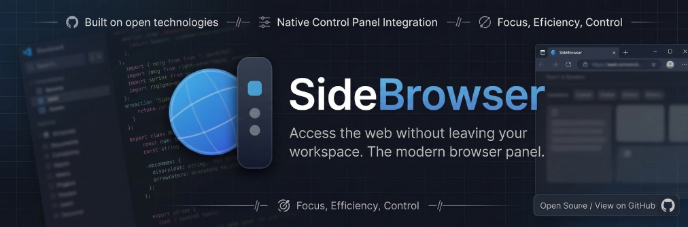

<div align="center">



# 🌐 Side Browser

**A sleek, edge-snapping side browser panel for Windows.**

Pin it to the left or right edge of your screen — it slides in when you hover the edge, just like a drawer.

[](LICENSE)
[](https://electronjs.org)
[](https://react.dev)
[](https://typescriptlang.org)

[✨ Features](#-features) • [📥 Download](#-download) • [🚀 Getting Started](#-getting-started) • [🧱 Tech Stack](#-tech-stack)

</div>

---

## 📥 Download

Get the latest version of Side Browser from the [Releases](https://github.com/kionit-labs/SideBrowser/releases) page.

| Version | Description |
|---------|-------------|
| **[SideBrowser-Setup.exe](https://github.com/kionit-labs/SideBrowser/releases)** | Recommended. Includes auto-updates and full installation. |
| **[SideBrowser.exe](https://github.com/kionit-labs/SideBrowser/releases)** | Standalone executable. No installation required. |

---

## 🎬 Showcase

<div align="center">
  <video src="https://github.com/user-attachments/assets/0a6103be-fc86-475f-8f54-52cf92b518a9" autoplay loop muted playsinline width="100%"></video>
</div>

---

## ✨ Features

| Feature | Description |
|---------|-------------|
| 🧲 **Edge Snapping** | Docks to screen edges, auto-hides when you click away |
| 🗂️ **Tabbed Browsing** | Multiple sites with icon-based sidebar for instant switching |
| 🛡️ **Built-in Adblock** | Powered by Ghostery engine for a clean, fast experience |
| 🔐 **Password Manager** | Securely manage and import credentials via CSV |
| 🎨 **Theme Engine** | Multiple colors + Dark / Light / System auto-mode |
| 🪟 **Transparency** | Adjustable window opacity for a premium glass look |
| 📍 **Address Bar** | Choose between Top, Bottom, or Auto-hide URL bar |
| 📱 **Device Emulation** | Switch between Desktop and Mobile view per tab |
| 🔇 **Per-Tab Audio** | Mute, reload, and manage audio for each tab individually |
| 🖥️ **System Tray** | Completely hide to tray when not in use |
| ⌨️ **Global Shortcut** | Toggle browser visibility with `Ctrl+Alt+S` |

---

## 🚀 Getting Started

### Prerequisites

- [Node.js](https://nodejs.org/) v18+
- Windows 10 / 11

### For Developers

```bash
# Clone the repository
git clone https://github.com/kionit-labs/SideBrowser.git

# Install dependencies
npm install

# Run in development mode
npm run dev

# Build the project
npm run build
```

---

## 🧱 Tech Stack

<div align="center">

| | Technology | Purpose |
|---|-----------|---------|
| ⚡ | **Electron 41** | Modern desktop shell |
| ⚛️ | **React 19** | Modern UI framework |
| 🔷 | **TypeScript 5.9** | Type safety & productivity |
| 💨 | **Tailwind CSS 4** | Sleek & customizable styling |
| 🎞️ | **Framer Motion** | Physics-based animations |
| 🎯 | **Lucide React** | Premium icon set |
| 🛡️ | **Ghostery Adblocker** | Enterprise-grade ad blocking |
| 💾 | **electron-datastore** | Local preference persistence |

</div>

---

## 📁 Project Structure

```bash
SideBrowser/
├── .github/                 # GitHub Actions (Auto-release workflows)
├── assets/                  # Project assets (Banner, Icons)
├── electron/                # Main Process (Electron)
│   ├── main.ts              # Windows, Tray, Edge-snapping logic
│   ├── preload.ts           # IPC Bridge (Main ↔ Renderer)
│   └── webview-preload.ts   # Webview injection (Theme, adblock)
├── src/                     # Renderer Process (React + TypeScript)
│   ├── App.tsx              # Main layout, Sidebar & Tab logic
│   ├── Browser.tsx          # Webview wrapper & navigation
│   ├── Home.tsx             # New Tab / Homepage view
│   ├── Settings.tsx         # User preferences panel
│   ├── contexts/            # Global state (Settings, Theme)
│   └── utils/               # Color & styling utilities
├── public/                  # Static assets & icons
├── LICENSE                  # GNU GPLv3 License
└── package.json             # Build scripts & dependencies
```

---

## 📄 License

[GNU GPLv3](LICENSE) © 2026 [kionit-labs](https://github.com/kionit-labs)

---

## 🤝 Contributing

Contributions, issues, and feature requests are welcome!
Feel free to open a [pull request](https://github.com/kionit-labs/SideBrowser/pulls) or [issue](https://github.com/kionit-labs/SideBrowser/issues).

---

<div align="center">
  Built with ❤️ by <a href="https://github.com/kionit-labs">kionit-labs</a>
</div>
